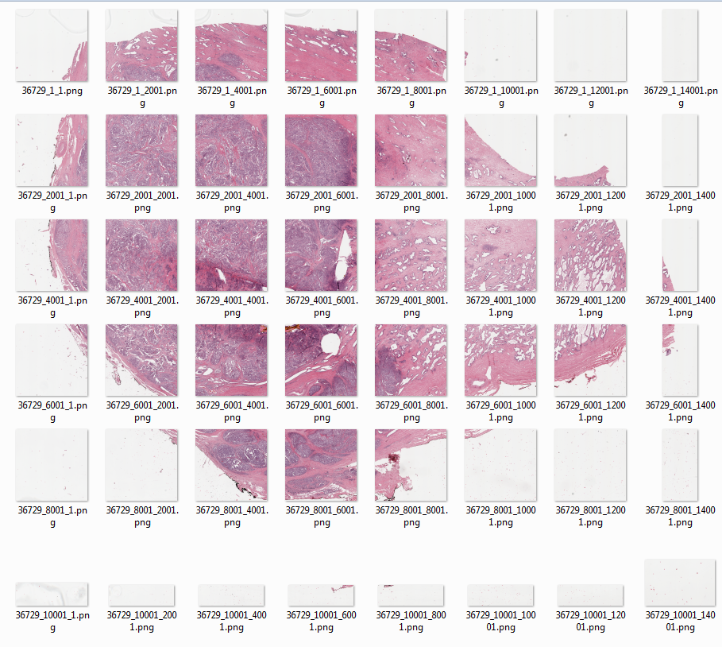
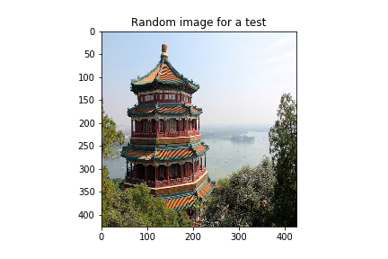
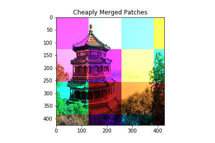

# Common Image segmentation utilities

Training deep neural networks for Image segmentation usually involves training models on small patches rather than full images due to memory constraints. This repo provides some common utilities for patch generation, recombination and simple segmentation mask conversion.

### Utilities

##### Patch generation

Patch generation is one of the most important part in input-output pipeline of segmentation task where the whole high resoltion image is divided into small tiles  

Also, the corresponding mask is also divided into small tiles  

You can use function `create_patches` in `utils.py` to create patches with or without overlap. For further information look into the help string of the function.

##### Patch recombination

After training segmentation model on patches as a final step all the predictions on patches has to be combined to get image segmentation mask 
Usually, any Segmentation DL model output dense class probability mask instead of discrete class mask. Hence, it is reccomended that first probability patches be stitched together to get final probability mask which can be thresholded to get final dense prediction.

This repo provides two methods for patch recombination

* Naive method
   
   Naive method assumes linear recombination of patches and gives relative weightage to patches with twice overlap(i.e. stride = 0.5*patch_size) as shown
   
   
   
   Usually, segmentation models like U-Net take image patches and make predictions on those small local windows, without data   near the border of the patches, so there might first be a high error on the predictions made near the outside of the window, in plus of the fact that predictions may be just concatenated, so it looks even more jagged. Therfore, predicting on overlapping patches and recombination through naive method helps in preventing jagged predictions.
   
   You can use `stitch_patch` function in `utils.py` to recombine the patches using naive method. For more information look into the help string of the function

   In practice this method works pretty well but still there may still be some boundary effects if receptive field of model is extremely small. Therefore, for more smooth predictions another ecombination method is provided.

* Smoothing-spline method

  This method use smoothing splines interpolation and Dihedral group rotation averaging of patches to reduce variance in stitched image. It gives smoothly varying weightage to different areas in patches 
  
   
  
  For eg. if following test image
  
  
  
  is broken into patches with some added noise then simply concatenating the patches together would result in following recombined image
  
  
  
  but if combined through smoothing-spline method then the same combined image would look like this: 
  
  

  You can either see demo of this method by directly running `smooth_stitch.py` or can import window function in your code to directly predict on large input image


```python
from smooth_stitch import predict_img_with_smooth_windowing

from your_code import your_model

# Instanciate a U-Net CNN (or any similarly-behaved neural network) in the variable named `model`. We use a Keras model but it can be anything:
model = your_model()

# CNN's receptive field's border size: size of patches
window_size = 160

# Amount of categories predicted per pixels.
nb_classes = 10

# Load an image. Convention is channel_last, such as having an input_img.shape of: (x, y, nb_channels), where nb_channels is of 3 for regular RGB images.
input_img = ...

# Use the algorithm. The `pred_func` is passed and will process all the image 8-fold by tiling small patches with overlap, called once with all those image as a batch outer dimension.
# Note that model.predict(...) accepts a 4D tensor of shape (batch, x, y, nb_channels), such as a Keras model.
predictions_smooth = predict_img_with_smooth_windowing(
    input_img,
    window_size=window_size,
    subdivisions=2,  # Minimal amount of overlap for windowing. Must be an even number.
    nb_classes=nb_classes,
    pred_func=(
        lambda img_batch_subdiv: model.predict(image_to_neural_input(img_batch_subdiv))
    )
)

# For more details, refer to comments and code in smooth_tiled_predictions.py
```

##### RBG segmentation mask to Multi channel one hot encoded mask

Often in Multi class segmentation target masks are provided as RGB mask in which one unique pixel value represents one class but for tarining of DL models one-hot encoded masks are required as per any DL framework api.
You can use function `rgb_to_mask` in `utils.py` for converting rgb mask to multi channel one hot encoded mask and `mask_to_rgb` for vice-versa

##### RGB segmentation mask to binary encoded mask

Sometimes, it is also required to train binary models on indivdual class in multi-class segmentation. In such a case binary segmentation masks are required for each class.
You can use function `create_binary_mask` in `utils.py` for this purpose

__This repo is inspired by [this](https://github.com/Vooban/Smoothly-Blend-Image-Patches) work__

[MIT License]()
